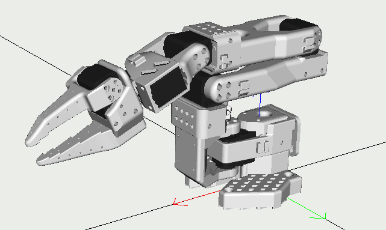
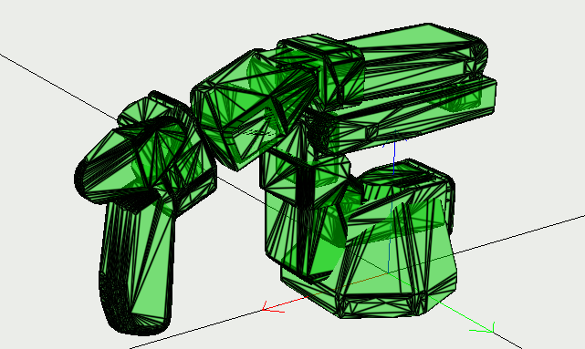
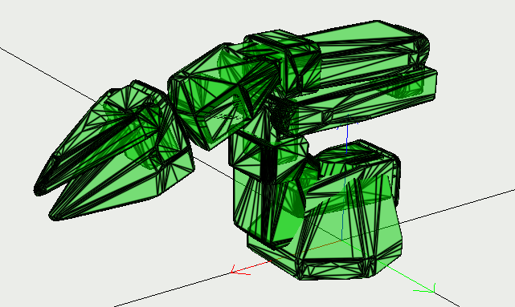

# SO-101 Description

This repository holds the descriptions for both variants of the [S0-101 arms](https://github.com/TheRobotStudio/SO-ARM100) in a format easily loaded by the [mc_rtc framework](https://jrl-umi3218.github.io/mc_rtc/).

The urdfs and stl meshes are from the original repository, with added [contact surfaces](rsdf) for the follower's gripper and [convex shapes](convex) for collision avoidance.

It is expected to be loaded by the [mc_so101](https://github.com/Hugo-L3174/mc_so101) robot module.

Leader | Follower
--- | ---
 | 
 | 
